# Hamster Plaza - Asset Index

Generated by `tools/build_asset_index.py` from `manifest.json` - do not edit by hand.
Rebuild the whole library with `tools/build_models.sh` (see [README.md](README.md)).

**240 unique models** + **36 UI icons**. Every model has a Roblox file (`.rbxm`), a 3D file (`.glb`, except particle effects) and `metadata.json`.

| Category | Models |
|---|---|
| [Animals](Animals/_preview.png) | 1 |
| [Buildings/Apartment](Buildings/Apartment/_preview.png) | 11 |
| [Buildings/Plaza](Buildings/Plaza/_preview.png) | 4 |
| [Decorations](Decorations/_preview.png) | 6 |
| [Effects](Effects/_preview.png) | 1 |
| [Environment](Environment/_preview.png) | 9 |
| [Furniture](Furniture/_preview.png) | 5 |
| [HamsterWheel](HamsterWheel/_preview.png) | 3 |
| [Hamsters/Ancient](Hamsters/Ancient/_preview.png) | 9 |
| [Hamsters/Basic](Hamsters/Basic/_preview.png) | 15 |
| [Hamsters/Celestial](Hamsters/Celestial/_preview.png) | 10 |
| [Hamsters/Cosmic](Hamsters/Cosmic/_preview.png) | 11 |
| [Hamsters/Cute](Hamsters/Cute/_preview.png) | 15 |
| [Hamsters/Divine](Hamsters/Divine/_preview.png) | 11 |
| [Hamsters/Epic](Hamsters/Epic/_preview.png) | 18 |
| [Hamsters/Legendary](Hamsters/Legendary/_preview.png) | 16 |
| [Hamsters/Mythic](Hamsters/Mythic/_preview.png) | 12 |
| [Hamsters/Rare](Hamsters/Rare/_preview.png) | 13 |
| [Hamsters/Secret](Hamsters/Secret/_preview.png) | 10 |
| [Hamsters/Shiny](Hamsters/Shiny/_preview.png) | 14 |
| [Hamsters/Ultra](Hamsters/Ultra/_preview.png) | 12 |
| [Hamsters/Unknown](Hamsters/Unknown/_preview.png) | 6 |
| [Plants](Plants/_preview.png) | 9 |
| [Props](Props/_preview.png) | 2 |
| [Props/Stations](Props/Stations/_preview.png) | 10 |
| [Trees](Trees/_preview.png) | 7 |
| [UI/Icons](UI/Icons/_contact_sheet.png) | 36 icons (PNG) |

## Animals

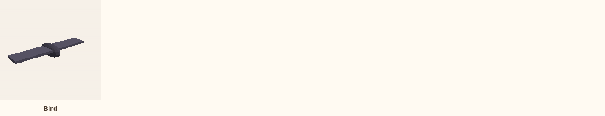

| Asset | Size (studs, X x Y x Z) | Parts | Built by | Notes |
|---|---|---|---|---|
| [Bird](Animals/Bird/) | 4.8 x 0.7 x 1.6 | 3 | `Decor.bird` |  |

## Buildings/Apartment

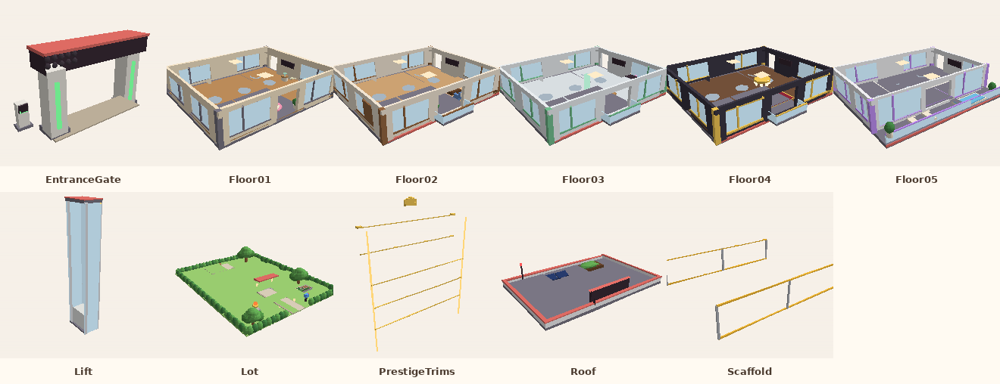

| Asset | Size (studs, X x Y x Z) | Parts | Built by | Notes |
|---|---|---|---|---|
| [EntranceGate](Buildings/Apartment/EntranceGate/) | 22 x 13.33 x 7.4 | 23 | `HouseBuilder (buildGate)` | Gate with name canopy, security lasers and the security kiosk. |
| [Floor01](Buildings/Apartment/Floor01/) | 53.4 x 12 x 43.4 | 169 | `HouseBuilder (buildFloor 1)` | Workshop - Main hamster production; unlocks at rebirth 0. Modular storey: stack Floor01..Floor05, then Roof. Wheels are separate (HamsterWheel). |
| [Floor02](Buildings/Apartment/Floor02/) | 53.4 x 11.3 x 46.7 | 157 | `HouseBuilder (buildFloor 2)` | Hamster Lofts - More hamster slots; unlocks at rebirth 2. Modular storey: stack Floor01..Floor05, then Roof. Wheels are separate (HamsterWheel). |
| [Floor03](Buildings/Apartment/Floor03/) | 53.4 x 11.3 x 46.7 | 147 | `HouseBuilder (buildFloor 3)` | Research Lab - Advanced upgrades; unlocks at rebirth 5. Modular storey: stack Floor01..Floor05, then Roof. Wheels are separate (HamsterWheel). |
| [Floor04](Buildings/Apartment/Floor04/) | 53.4 x 11.3 x 46.7 | 145 | `HouseBuilder (buildFloor 4)` | Golden Suites - High-tier hamster production; unlocks at rebirth 9. Modular storey: stack Floor01..Floor05, then Roof. Wheels are separate (HamsterWheel). |
| [Floor05](Buildings/Apartment/Floor05/) | 53.4 x 11.3 x 43.4 | 141 | `HouseBuilder (buildFloor 5)` | Penthouse - Prestige hamster area; unlocks at rebirth 14. Modular storey: stack Floor01..Floor05, then Roof. Wheels are separate (HamsterWheel). |
| [Lift](Buildings/Apartment/Lift/) | 8.5 x 59.75 x 13 | 13 | `HouseBuilder (buildLift)` | Glass lift tower beside the building (shown at 5 floors). |
| [Lot](Buildings/Apartment/Lot/) | 76.6 x 14.21 x 97 | 219 | `HouseBuilder (buildYard)` | Garden lot: lawn, driveway, hedges, trees, patio (without the gate). |
| [PrestigeTrims](Buildings/Apartment/PrestigeTrims/) | 53.8 x 66.2 x 10.7 | 15 | `HouseBuilder.setPrestige(20)` | Gold bands (R10), crown (R15) and light strips (R20) for a 5-floor apartment. |
| [Roof](Buildings/Apartment/Roof/) | 54 x 9.6 x 36 | 20 | `HouseBuilder (buildRoof)` | Sits on top of the highest floor. |
| [Scaffold](Buildings/Apartment/Scaffold/) | 50.4 x 10.18 x 40.4 | 11 | `HouseBuilder (buildScaffold)` | Next floor under construction, with the 'unlocks at rebirth' sign. |

## Buildings/Plaza

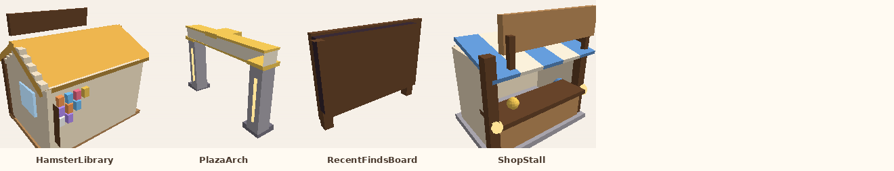

| Asset | Size (studs, X x Y x Z) | Parts | Built by | Notes |
|---|---|---|---|---|
| [HamsterLibrary](Buildings/Plaza/HamsterLibrary/) | 15.6 x 13.7 x 11.56 | 56 | `PlazaBuilder (HamsterLibrary)` |  |
| [PlazaArch](Buildings/Plaza/PlazaArch/) | 7 x 23 x 35.6 | 14 | `PlazaBuilder (PlazaArch)` |  |
| [RecentFindsBoard](Buildings/Plaza/RecentFindsBoard/) | 13 x 9.8 x 1.1 | 4 | `PlazaBuilder (RecentFinds)` |  |
| [ShopStall](Buildings/Plaza/ShopStall/) | 11 x 11.4 x 8.35 | 20 | `PlazaBuilder (ShopStall)` |  |

## Decorations

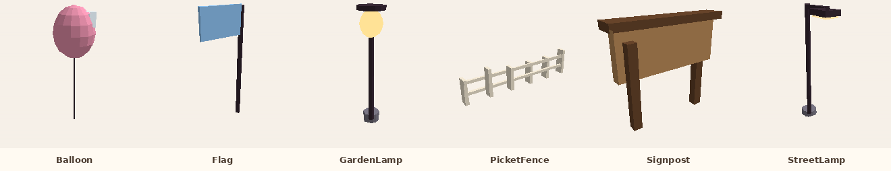

| Asset | Size (studs, X x Y x Z) | Parts | Built by | Notes |
|---|---|---|---|---|
| [Balloon](Decorations/Balloon/) | 2.6 x 8 x 2.6 | 3 | `Decor.balloon` |  |
| [Flag](Decorations/Flag/) | 3.65 x 9.1 x 0.3 | 2 | `Decor.flag` |  |
| [GardenLamp](Decorations/GardenLamp/) | 2.2 x 10.15 x 2.2 | 4 | `Decor.lamp` |  |
| [PicketFence](Decorations/PicketFence/) | 16.35 x 3.8 x 1.1 | 8 | `Decor.fenceRun` |  |
| [Signpost](Decorations/Signpost/) | 7 x 6.1 x 1.2 | 4 | `Decor.signpost` |  |
| [StreetLamp](Decorations/StreetLamp/) | 1.6 x 12 x 4.5 | 5 | `Decor.streetLamp` |  |

## Effects

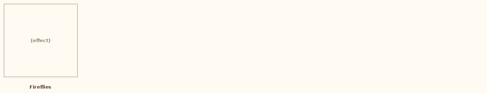

| Asset | Size (studs, X x Y x Z) | Parts | Built by | Notes |
|---|---|---|---|---|
| [Fireflies](Effects/Fireflies/) | 0 x 0 x 0 | 0 | `Decor.fireflies` | Invisible part with a ParticleEmitter (no mesh). |

## Environment

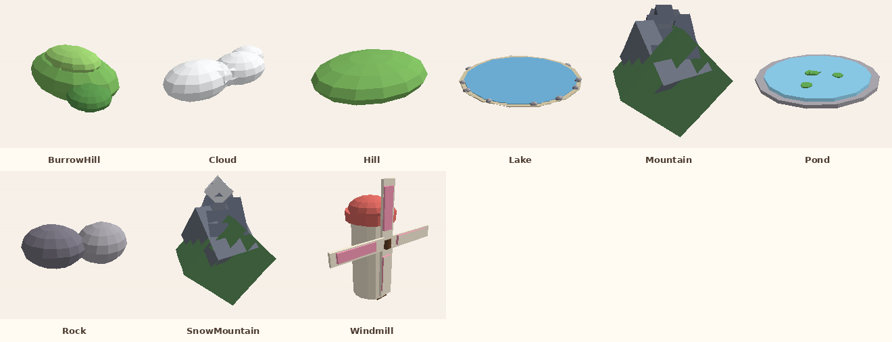

| Asset | Size (studs, X x Y x Z) | Parts | Built by | Notes |
|---|---|---|---|---|
| [BurrowHill](Environment/BurrowHill/) | 32 x 20.5 x 52 | 3 | `PathBuilder (buildBurrow)` | Where the hamsters come out of the ground. |
| [Cloud](Environment/Cloud/) | 59.04 x 18.07 x 27.04 | 4 | `Decor.cloud` |  |
| [Hill](Environment/Hill/) | 60 x 18 x 50 | 1 | `Decor.hill` |  |
| [Lake](Environment/Lake/) | 302.63 x 11.64 x 300 | 22 | `EnvironmentBuilder (buildBackdrop)` |  |
| [Mountain](Environment/Mountain/) | 138.76 x 140.25 x 109.2 | 5 | `Decor.mountain` |  |
| [Pond](Environment/Pond/) | 18.4 x 0.75 x 18.4 | 7 | `Decor.pond` |  |
| [Rock](Environment/Rock/) | 4.86 x 1.67 x 3.77 | 2 | `Decor.rock` |  |
| [SnowMountain](Environment/SnowMountain/) | 138.76 x 165.18 x 109.2 | 6 | `Decor.mountain(snow)` |  |
| [Windmill](Environment/Windmill/) | 15 x 16 x 6.9 | 13 | `Decor.windmill` |  |

## Furniture

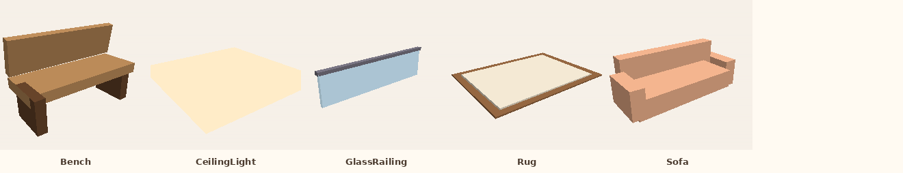

| Asset | Size (studs, X x Y x Z) | Parts | Built by | Notes |
|---|---|---|---|---|
| [Bench](Furniture/Bench/) | 5 x 3.22 x 1.97 | 4 | `Decor.bench` |  |
| [CeilingLight](Furniture/CeilingLight/) | 4 x 0.25 x 4 | 1 | `HouseBuilder.Furniture.CeilingLight` |  |
| [GlassRailing](Furniture/GlassRailing/) | 10.2 x 2.82 x 0.4 | 2 | `HouseBuilder.Furniture.Railing` |  |
| [Rug](Furniture/Rug/) | 8 x 0.09 x 6 | 2 | `HouseBuilder.Furniture.Rug` |  |
| [Sofa](Furniture/Sofa/) | 7.8 x 2.9 x 2.8 | 5 | `HouseBuilder.Furniture.Sofa` |  |

## HamsterWheel

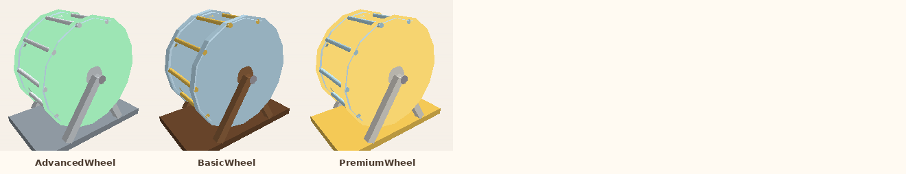

| Asset | Size (studs, X x Y x Z) | Parts | Built by | Notes |
|---|---|---|---|---|
| [AdvancedWheel](HamsterWheel/AdvancedWheel/) | 7.4 x 6.75 x 4.6 | 24 | `HouseBuilder (buildWheel) - style AdvancedWheel` | The child model 'Wheel' turns around the hub's X axis (attribute HomeCFrame, AmbientController SpinModel). |
| [BasicWheel](HamsterWheel/BasicWheel/) | 7.4 x 6.75 x 4.6 | 24 | `HouseBuilder (buildWheel) - style BasicWheel` | The child model 'Wheel' turns around the hub's X axis (attribute HomeCFrame, AmbientController SpinModel). |
| [PremiumWheel](HamsterWheel/PremiumWheel/) | 7.4 x 6.75 x 4.6 | 24 | `HouseBuilder (buildWheel) - style PremiumWheel` | The child model 'Wheel' turns around the hub's X axis (attribute HomeCFrame, AmbientController SpinModel). |

## Hamsters/Ancient

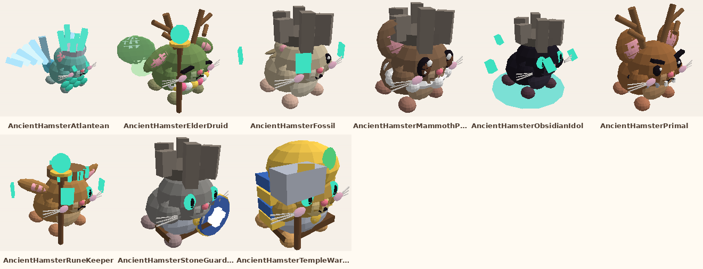

| Asset | Name in game | Id | Price | Income/s | Spawn chance | Speed | From rebirth | Parts |
|---|---|---|---|---|---|---|---|---|
| [AncientHamsterFossil](Hamsters/Ancient/AncientHamsterFossil/) | Fossil | `fossil` | $7B | $5M | 0.0002243% | 48 | 12 | 44 |
| [AncientHamsterStoneGuardian](Hamsters/Ancient/AncientHamsterStoneGuardian/) | Stone Guardian | `stone_guardian` | $7.4B | $5.29M | 0.0002243% | 48 | 12 | 38 |
| [AncientHamsterRuneKeeper](Hamsters/Ancient/AncientHamsterRuneKeeper/) | Rune Keeper | `rune_keeper` | $7.9B | $5.64M | 0.0002243% | 48 | 12 | 43 |
| [AncientHamsterPrimal](Hamsters/Ancient/AncientHamsterPrimal/) | Primal | `primal` | $8.3B | $5.93M | 0.0002243% | 48 | 12 | 53 |
| [AncientHamsterMammothPup](Hamsters/Ancient/AncientHamsterMammothPup/) | Mammoth Pup | `mammoth_pup` | $8.8B | $6.29M | 0.0002243% | 48 | 12 | 49 |
| [AncientHamsterTempleWarden](Hamsters/Ancient/AncientHamsterTempleWarden/) | Temple Warden | `temple_warden` | $9.2B | $6.57M | 0.0002243% | 48 | 12 | 44 |
| [AncientHamsterAtlantean](Hamsters/Ancient/AncientHamsterAtlantean/) | Atlantean | `atlantean` | $9.6B | $6.86M | 0.0002243% | 48 | 12 | 59 |
| [AncientHamsterElderDruid](Hamsters/Ancient/AncientHamsterElderDruid/) | Elder Druid | `elder_druid` | $10B | $7.14M | 0.0002243% | 48 | 12 | 54 |
| [AncientHamsterObsidianIdol](Hamsters/Ancient/AncientHamsterObsidianIdol/) | Obsidian Idol | `obsidian_idol` | $11B | $7.86M | 0.0002243% | 48 | 12 | 35 |

## Hamsters/Basic

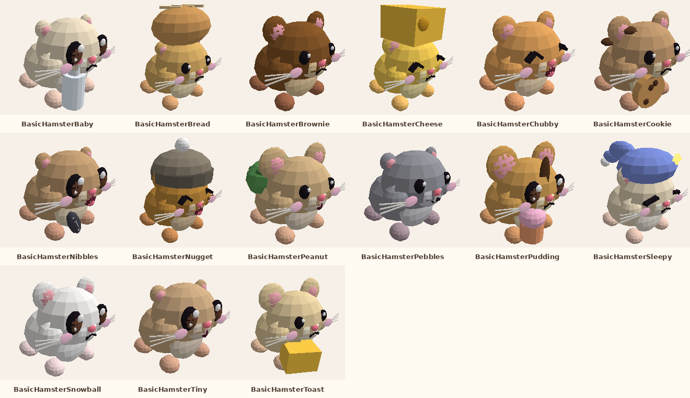

| Asset | Name in game | Id | Price | Income/s | Spawn chance | Speed | From rebirth | Parts |
|---|---|---|---|---|---|---|---|---|
| [BasicHamsterBrownie](Hamsters/Basic/BasicHamsterBrownie/) | Brownie | `brownie` | $100 | $1.67 | 3.499% | 9 | 0 | 30 |
| [BasicHamsterSnowball](Hamsters/Basic/BasicHamsterSnowball/) | Snowball | `snowball` | $100 | $1.67 | 3.499% | 9 | 0 | 34 |
| [BasicHamsterPebbles](Hamsters/Basic/BasicHamsterPebbles/) | Pebbles | `pebbles` | $110 | $1.83 | 3.499% | 9 | 0 | 29 |
| [BasicHamsterSleepy](Hamsters/Basic/BasicHamsterSleepy/) | Sleepy | `sleepy` | $110 | $1.83 | 3.499% | 9 | 0 | 38 |
| [BasicHamsterTiny](Hamsters/Basic/BasicHamsterTiny/) | Tiny | `tiny` | $110 | $1.83 | 3.499% | 9 | 0 | 33 |
| [BasicHamsterBaby](Hamsters/Basic/BasicHamsterBaby/) | Baby | `baby` | $120 | $2 | 3.499% | 9 | 0 | 37 |
| [BasicHamsterChubby](Hamsters/Basic/BasicHamsterChubby/) | Chubby | `chubby` | $120 | $2 | 3.499% | 9 | 0 | 30 |
| [BasicHamsterBread](Hamsters/Basic/BasicHamsterBread/) | Bread | `bread` | $130 | $2.17 | 3.499% | 9 | 0 | 34 |
| [BasicHamsterCheese](Hamsters/Basic/BasicHamsterCheese/) | Cheese | `cheese` | $130 | $2.17 | 3.499% | 9 | 0 | 33 |
| [BasicHamsterCookie](Hamsters/Basic/BasicHamsterCookie/) | Cookie | `cookie` | $130 | $2.17 | 3.499% | 9 | 0 | 39 |
| [BasicHamsterPeanut](Hamsters/Basic/BasicHamsterPeanut/) | Peanut | `peanut` | $140 | $2.33 | 3.499% | 9 | 0 | 35 |
| [BasicHamsterPudding](Hamsters/Basic/BasicHamsterPudding/) | Pudding | `pudding` | $140 | $2.33 | 3.499% | 9 | 0 | 38 |
| [BasicHamsterToast](Hamsters/Basic/BasicHamsterToast/) | Toast | `toast` | $140 | $2.33 | 3.499% | 9 | 0 | 32 |
| [BasicHamsterNibbles](Hamsters/Basic/BasicHamsterNibbles/) | Nibbles | `nibbles` | $150 | $2.5 | 3.499% | 9 | 0 | 36 |
| [BasicHamsterNugget](Hamsters/Basic/BasicHamsterNugget/) | Nugget | `nugget` | $150 | $2.5 | 3.499% | 9 | 0 | 38 |

## Hamsters/Celestial

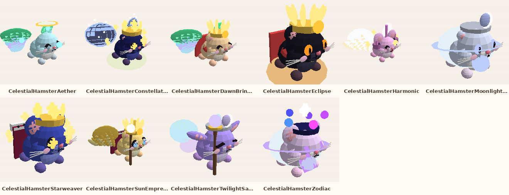

| Asset | Name in game | Id | Price | Income/s | Spawn chance | Speed | From rebirth | Parts |
|---|---|---|---|---|---|---|---|---|
| [CelestialHamsterDawnBringer](Hamsters/Celestial/CelestialHamsterDawnBringer/) | Dawn Bringer | `dawn_bringer` | $340M | $386K | 0.001211% | 38 | 7 | 54 |
| [CelestialHamsterTwilightSage](Hamsters/Celestial/CelestialHamsterTwilightSage/) | Twilight Sage | `twilight_sage` | $360M | $409K | 0.001211% | 38 | 7 | 42 |
| [CelestialHamsterStarweaver](Hamsters/Celestial/CelestialHamsterStarweaver/) | Starweaver | `starweaver` | $380M | $432K | 0.001211% | 38 | 7 | 81 |
| [CelestialHamsterMoonlightOracle](Hamsters/Celestial/CelestialHamsterMoonlightOracle/) | Moonlight Oracle | `moonlight_oracle` | $400M | $455K | 0.001211% | 38 | 7 | 36 |
| [CelestialHamsterSunEmpress](Hamsters/Celestial/CelestialHamsterSunEmpress/) | Sun Empress | `sun_empress` | $420M | $477K | 0.001211% | 38 | 7 | 72 |
| [CelestialHamsterAether](Hamsters/Celestial/CelestialHamsterAether/) | Aether | `aether` | $430M | $489K | 0.001211% | 38 | 7 | 41 |
| [CelestialHamsterConstellation](Hamsters/Celestial/CelestialHamsterConstellation/) | Constellation | `constellation` | $450M | $511K | 0.001211% | 38 | 7 | 92 |
| [CelestialHamsterZodiac](Hamsters/Celestial/CelestialHamsterZodiac/) | Zodiac | `zodiac` | $470M | $534K | 0.001211% | 38 | 7 | 42 |
| [CelestialHamsterEclipse](Hamsters/Celestial/CelestialHamsterEclipse/) | Eclipse | `eclipse` | $490M | $557K | 0.001211% | 38 | 7 | 44 |
| [CelestialHamsterHarmonic](Hamsters/Celestial/CelestialHamsterHarmonic/) | Harmonic | `harmonic` | $510M | $580K | 0.001211% | 38 | 7 | 71 |

## Hamsters/Cosmic

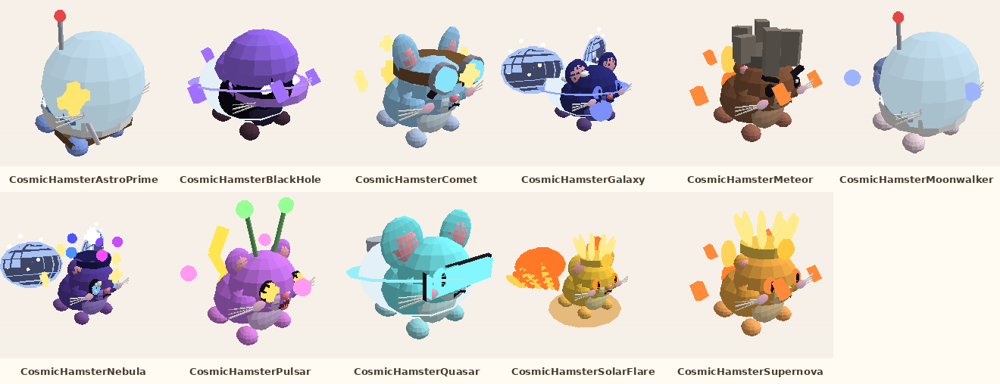

| Asset | Name in game | Id | Price | Income/s | Spawn chance | Speed | From rebirth | Parts |
|---|---|---|---|---|---|---|---|---|
| [CosmicHamsterNebula](Hamsters/Cosmic/CosmicHamsterNebula/) | Nebula | `nebula` | $75M | $107K | 0.002294% | 34 | 5 | 80 |
| [CosmicHamsterGalaxy](Hamsters/Cosmic/CosmicHamsterGalaxy/) | Galaxy | `galaxy` | $79M | $113K | 0.002294% | 34 | 5 | 56 |
| [CosmicHamsterSupernova](Hamsters/Cosmic/CosmicHamsterSupernova/) | Supernova | `supernova` | $83M | $119K | 0.002294% | 34 | 5 | 47 |
| [CosmicHamsterComet](Hamsters/Cosmic/CosmicHamsterComet/) | Comet | `comet` | $86M | $123K | 0.002294% | 34 | 5 | 55 |
| [CosmicHamsterBlackHole](Hamsters/Cosmic/CosmicHamsterBlackHole/) | Black Hole | `black_hole` | $90M | $129K | 0.002294% | 34 | 5 | 30 |
| [CosmicHamsterQuasar](Hamsters/Cosmic/CosmicHamsterQuasar/) | Quasar | `quasar` | $94M | $134K | 0.002294% | 34 | 5 | 41 |
| [CosmicHamsterPulsar](Hamsters/Cosmic/CosmicHamsterPulsar/) | Pulsar | `pulsar` | $98M | $140K | 0.002294% | 34 | 5 | 46 |
| [CosmicHamsterMeteor](Hamsters/Cosmic/CosmicHamsterMeteor/) | Meteor | `meteor` | $100M | $143K | 0.002294% | 34 | 5 | 45 |
| [CosmicHamsterAstroPrime](Hamsters/Cosmic/CosmicHamsterAstroPrime/) | Astro Prime | `astro_prime` | $110M | $157K | 0.002294% | 34 | 5 | 48 |
| [CosmicHamsterMoonwalker](Hamsters/Cosmic/CosmicHamsterMoonwalker/) | Moonwalker | `moonwalker` | $110M | $157K | 0.002294% | 34 | 5 | 38 |
| [CosmicHamsterSolarFlare](Hamsters/Cosmic/CosmicHamsterSolarFlare/) | Solar Flare | `solar_flare` | $110M | $157K | 0.002294% | 34 | 5 | 56 |

## Hamsters/Cute

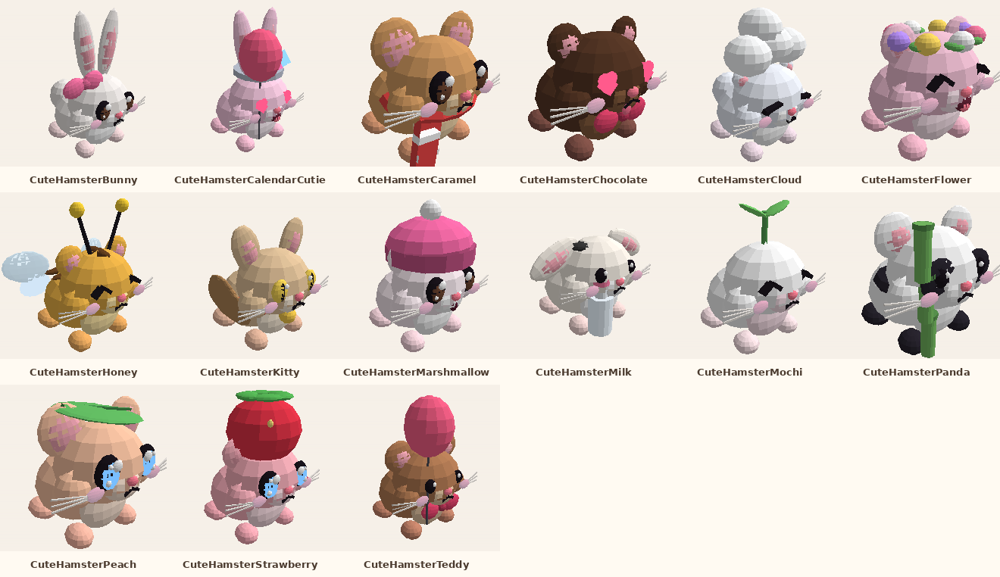

| Asset | Name in game | Id | Price | Income/s | Spawn chance | Speed | From rebirth | Parts |
|---|---|---|---|---|---|---|---|---|
| [CuteHamsterPanda](Hamsters/Cute/CuteHamsterPanda/) | Panda | `panda` | $450 | $5.62 | 1.803% | 10.5 | 0 | 39 |
| [CuteHamsterBunny](Hamsters/Cute/CuteHamsterBunny/) | Bunny | `bunny` | $470 | $5.88 | 1.803% | 10.5 | 0 | 38 |
| [CuteHamsterStrawberry](Hamsters/Cute/CuteHamsterStrawberry/) | Strawberry | `strawberry` | $480 | $6 | 1.803% | 10.5 | 0 | 54 |
| [CuteHamsterHoney](Hamsters/Cute/CuteHamsterHoney/) | Honey | `honey` | $500 | $6.25 | 1.803% | 10.5 | 0 | 44 |
| [CuteHamsterFlower](Hamsters/Cute/CuteHamsterFlower/) | Flower | `flower` | $520 | $6.5 | 1.803% | 10.5 | 0 | 46 |
| [CuteHamsterCloud](Hamsters/Cute/CuteHamsterCloud/) | Cloud | `cloud` | $540 | $6.75 | 1.803% | 10.5 | 0 | 33 |
| [CuteHamsterMarshmallow](Hamsters/Cute/CuteHamsterMarshmallow/) | Marshmallow | `marshmallow` | $550 | $6.88 | 1.803% | 10.5 | 0 | 36 |
| [CuteHamsterCalendarCutie](Hamsters/Cute/CuteHamsterCalendarCutie/) | Calendar Cutie | `calendar_cutie` | $560 | $7 | 0% | 10.5 | 0 | 40 |
| [CuteHamsterMilk](Hamsters/Cute/CuteHamsterMilk/) | Milk | `milk` | $570 | $7.12 | 1.803% | 10.5 | 0 | 37 |
| [CuteHamsterChocolate](Hamsters/Cute/CuteHamsterChocolate/) | Chocolate | `chocolate` | $590 | $7.38 | 1.803% | 10.5 | 0 | 36 |
| [CuteHamsterCaramel](Hamsters/Cute/CuteHamsterCaramel/) | Caramel | `caramel` | $610 | $7.62 | 1.803% | 10.5 | 0 | 38 |
| [CuteHamsterKitty](Hamsters/Cute/CuteHamsterKitty/) | Kitty | `kitty` | $620 | $7.75 | 1.803% | 10.5 | 0 | 43 |
| [CuteHamsterTeddy](Hamsters/Cute/CuteHamsterTeddy/) | Teddy | `teddy` | $640 | $8 | 1.803% | 10.5 | 0 | 35 |
| [CuteHamsterPeach](Hamsters/Cute/CuteHamsterPeach/) | Peach | `peach` | $660 | $8.25 | 1.803% | 10.5 | 0 | 44 |
| [CuteHamsterMochi](Hamsters/Cute/CuteHamsterMochi/) | Mochi | `mochi` | $680 | $8.5 | 1.803% | 10.5 | 0 | 29 |

## Hamsters/Divine

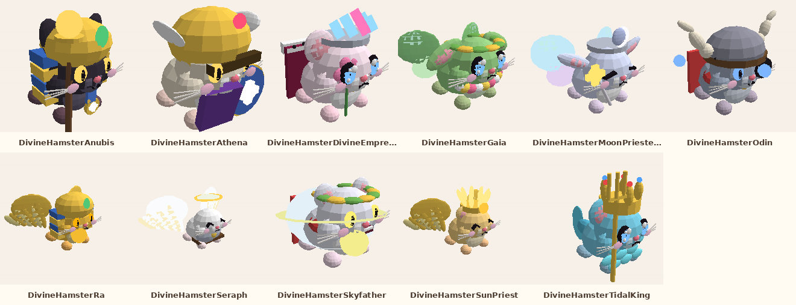

| Asset | Name in game | Id | Price | Income/s | Spawn chance | Speed | From rebirth | Parts |
|---|---|---|---|---|---|---|---|---|
| [DivineHamsterSkyfather](Hamsters/Divine/DivineHamsterSkyfather/) | Skyfather | `skyfather` | $16M | $28.6K | 0.005506% | 30 | 3 | 47 |
| [DivineHamsterTidalKing](Hamsters/Divine/DivineHamsterTidalKing/) | Tidal King | `tidal_king` | $17M | $30.4K | 0.005506% | 30 | 3 | 63 |
| [DivineHamsterAthena](Hamsters/Divine/DivineHamsterAthena/) | Athena | `athena` | $18M | $32.1K | 0.005506% | 30 | 3 | 42 |
| [DivineHamsterSunPriest](Hamsters/Divine/DivineHamsterSunPriest/) | Sun Priest | `sun_priest` | $18M | $32.1K | 0.005506% | 30 | 3 | 55 |
| [DivineHamsterMoonPriestess](Hamsters/Divine/DivineHamsterMoonPriestess/) | Moon Priestess | `moon_priestess` | $19M | $33.9K | 0.005506% | 30 | 3 | 44 |
| [DivineHamsterDivineEmpress](Hamsters/Divine/DivineHamsterDivineEmpress/) | Divine Empress | `divine_empress` | $20M | $35.7K | 0.005506% | 30 | 3 | 57 |
| [DivineHamsterRa](Hamsters/Divine/DivineHamsterRa/) | Ra | `ra` | $21M | $37.5K | 0.005506% | 30 | 3 | 56 |
| [DivineHamsterAnubis](Hamsters/Divine/DivineHamsterAnubis/) | Anubis | `anubis` | $22M | $39.3K | 0.005506% | 30 | 3 | 48 |
| [DivineHamsterOdin](Hamsters/Divine/DivineHamsterOdin/) | Odin | `odin` | $22M | $39.3K | 0.005506% | 30 | 3 | 45 |
| [DivineHamsterSeraph](Hamsters/Divine/DivineHamsterSeraph/) | Seraph | `seraph` | $23M | $41.1K | 0.005506% | 30 | 3 | 49 |
| [DivineHamsterGaia](Hamsters/Divine/DivineHamsterGaia/) | Gaia | `gaia` | $24M | $42.9K | 0.005506% | 30 | 3 | 61 |

## Hamsters/Epic

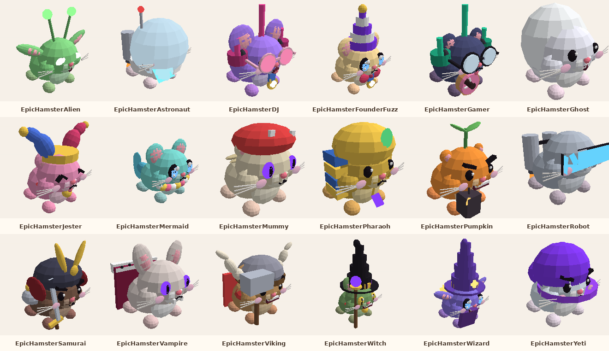

| Asset | Name in game | Id | Price | Income/s | Spawn chance | Speed | From rebirth | Parts |
|---|---|---|---|---|---|---|---|---|
| [EpicHamsterSamurai](Hamsters/Epic/EpicHamsterSamurai/) | Samurai | `samurai` | $40K | $200 | 0.1425% | 16.5 | 0 | 44 |
| [EpicHamsterViking](Hamsters/Epic/EpicHamsterViking/) | Viking | `viking` | $41K | $205 | 0.1425% | 16.5 | 0 | 45 |
| [EpicHamsterVampire](Hamsters/Epic/EpicHamsterVampire/) | Vampire | `vampire` | $43K | $215 | 0.1425% | 16.5 | 0 | 40 |
| [EpicHamsterMummy](Hamsters/Epic/EpicHamsterMummy/) | Mummy | `mummy` | $44K | $220 | 0.1425% | 16.5 | 0 | 37 |
| [EpicHamsterWitch](Hamsters/Epic/EpicHamsterWitch/) | Witch | `witch` | $45K | $225 | 0.1425% | 16.5 | 0 | 45 |
| [EpicHamsterPharaoh](Hamsters/Epic/EpicHamsterPharaoh/) | Pharaoh | `pharaoh` | $46K | $230 | 0.1425% | 16.5 | 0 | 42 |
| [EpicHamsterRobot](Hamsters/Epic/EpicHamsterRobot/) | Robot | `robot` | $48K | $240 | 0.1425% | 16.5 | 0 | 31 |
| [EpicHamsterAlien](Hamsters/Epic/EpicHamsterAlien/) | Alien | `alien` | $49K | $245 | 0.1425% | 16.5 | 0 | 29 |
| [EpicHamsterFounderFuzz](Hamsters/Epic/EpicHamsterFounderFuzz/) | Founder Fuzz | `founder_fuzz` | $50K | $250 | 0% | 16.5 | 0 | 51 |
| [EpicHamsterYeti](Hamsters/Epic/EpicHamsterYeti/) | Yeti | `yeti` | $50K | $250 | 0.1425% | 16.5 | 0 | 37 |
| [EpicHamsterMermaid](Hamsters/Epic/EpicHamsterMermaid/) | Mermaid | `mermaid` | $51K | $255 | 0.1425% | 16.5 | 0 | 47 |
| [EpicHamsterPumpkin](Hamsters/Epic/EpicHamsterPumpkin/) | Pumpkin | `pumpkin` | $53K | $265 | 0.1425% | 16.5 | 0 | 38 |
| [EpicHamsterGhost](Hamsters/Epic/EpicHamsterGhost/) | Ghost | `ghost` | $54K | $270 | 0.1425% | 16.5 | 0 | 28 |
| [EpicHamsterJester](Hamsters/Epic/EpicHamsterJester/) | Jester | `jester` | $55K | $275 | 0.1425% | 16.5 | 0 | 40 |
| [EpicHamsterWizard](Hamsters/Epic/EpicHamsterWizard/) | Wizard | `wizard` | $56K | $280 | 0.1425% | 16.5 | 0 | 53 |
| [EpicHamsterAstronaut](Hamsters/Epic/EpicHamsterAstronaut/) | Astronaut | `astronaut` | $58K | $290 | 0.1425% | 16.5 | 0 | 46 |
| [EpicHamsterDJ](Hamsters/Epic/EpicHamsterDJ/) | DJ | `dj` | $59K | $295 | 0.1425% | 16.5 | 0 | 50 |
| [EpicHamsterGamer](Hamsters/Epic/EpicHamsterGamer/) | Gamer | `gamer` | $60K | $300 | 0.1425% | 16.5 | 0 | 53 |

## Hamsters/Legendary

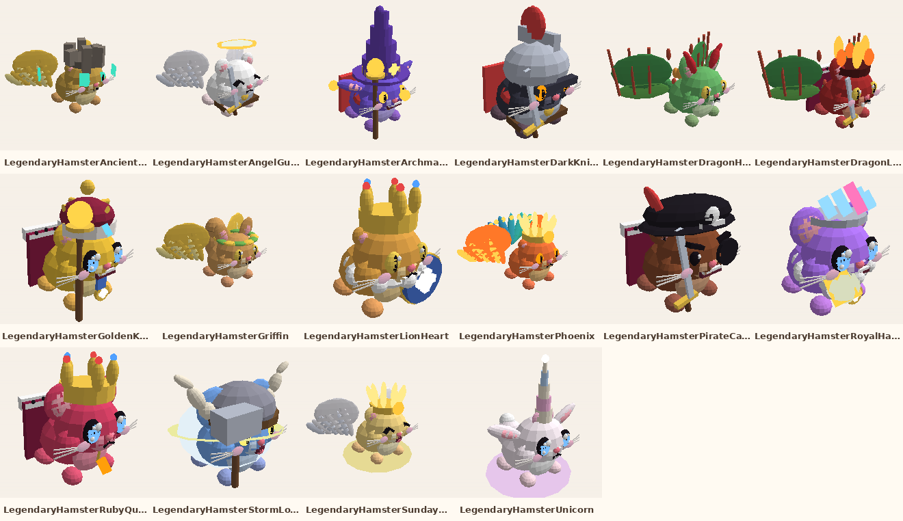

| Asset | Name in game | Id | Price | Income/s | Spawn chance | Speed | From rebirth | Parts |
|---|---|---|---|---|---|---|---|---|
| [LegendaryHamsterGoldenKing](Hamsters/Legendary/LegendaryHamsterGoldenKing/) | Golden King | `golden_king` | $800K | $2.35K | 0.02692% | 22 | 0 | 59 |
| [LegendaryHamsterDragonHamster](Hamsters/Legendary/LegendaryHamsterDragonHamster/) | Dragon Hamster | `dragon_hamster` | $830K | $2.44K | 0.02692% | 22 | 0 | 61 |
| [LegendaryHamsterPhoenix](Hamsters/Legendary/LegendaryHamsterPhoenix/) | Phoenix | `phoenix` | $860K | $2.53K | 0.02692% | 22 | 0 | 69 |
| [LegendaryHamsterUnicorn](Hamsters/Legendary/LegendaryHamsterUnicorn/) | Unicorn | `unicorn` | $890K | $2.62K | 0.02692% | 22 | 0 | 47 |
| [LegendaryHamsterGriffin](Hamsters/Legendary/LegendaryHamsterGriffin/) | Griffin | `griffin` | $910K | $2.68K | 0.02692% | 22 | 0 | 57 |
| [LegendaryHamsterAngelGuardian](Hamsters/Legendary/LegendaryHamsterAngelGuardian/) | Angel Guardian | `angel_guardian` | $940K | $2.76K | 0.02692% | 22 | 0 | 52 |
| [LegendaryHamsterArchmage](Hamsters/Legendary/LegendaryHamsterArchmage/) | Archmage | `archmage` | $970K | $2.85K | 0.02692% | 22 | 0 | 50 |
| [LegendaryHamsterLionHeart](Hamsters/Legendary/LegendaryHamsterLionHeart/) | Lion Heart | `lion_heart` | $1M | $2.94K | 0.02692% | 22 | 0 | 60 |
| [LegendaryHamsterPirateCaptain](Hamsters/Legendary/LegendaryHamsterPirateCaptain/) | Pirate Captain | `pirate_captain` | $1M | $2.94K | 0.02692% | 22 | 0 | 50 |
| [LegendaryHamsterSundaySunbeam](Hamsters/Legendary/LegendaryHamsterSundaySunbeam/) | Sunday Sunbeam | `sunday_sunbeam` | $1M | $2.94K | 0% | 22 | 0 | 56 |
| [LegendaryHamsterDarkKnight](Hamsters/Legendary/LegendaryHamsterDarkKnight/) | Dark Knight | `dark_knight` | $1.1M | $3.24K | 0.02692% | 22 | 0 | 41 |
| [LegendaryHamsterRoyalHamster](Hamsters/Legendary/LegendaryHamsterRoyalHamster/) | Royal Hamster | `royal_hamster` | $1.1M | $3.24K | 0.02692% | 22 | 0 | 59 |
| [LegendaryHamsterRubyQueen](Hamsters/Legendary/LegendaryHamsterRubyQueen/) | Ruby Queen | `ruby_queen` | $1.1M | $3.24K | 0.02692% | 22 | 0 | 57 |
| [LegendaryHamsterStormLord](Hamsters/Legendary/LegendaryHamsterStormLord/) | Storm Lord | `storm_lord` | $1.1M | $3.24K | 0.02692% | 22 | 0 | 42 |
| [LegendaryHamsterAncientHamster](Hamsters/Legendary/LegendaryHamsterAncientHamster/) | Ancient Hamster | `ancient_hamster` | $1.2M | $3.53K | 0.02692% | 22 | 0 | 54 |
| [LegendaryHamsterDragonLord](Hamsters/Legendary/LegendaryHamsterDragonLord/) | Dragon Lord | `dragon_lord` | $1.2M | $3.53K | 0.02692% | 22 | 0 | 70 |

## Hamsters/Mythic

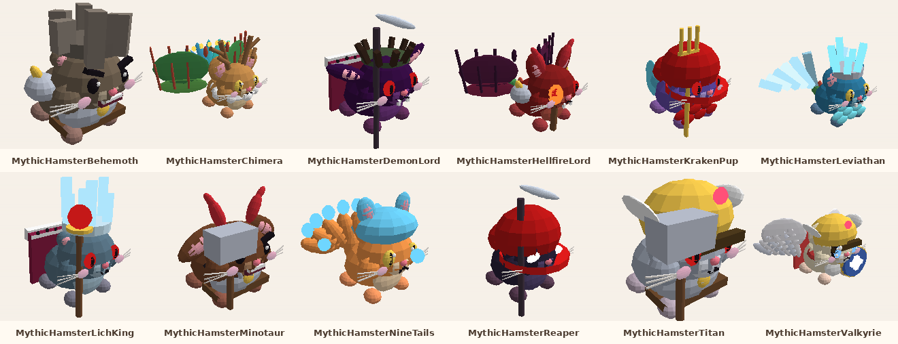

| Asset | Name in game | Id | Price | Income/s | Spawn chance | Speed | From rebirth | Parts |
|---|---|---|---|---|---|---|---|---|
| [MythicHamsterHellfireLord](Hamsters/Mythic/MythicHamsterHellfireLord/) | Hellfire Lord | `hellfire_lord` | $3.6M | $8.18K | 0.01346% | 26 | 1 | 60 |
| [MythicHamsterKrakenPup](Hamsters/Mythic/MythicHamsterKrakenPup/) | Kraken Pup | `kraken_pup` | $3.8M | $8.64K | 0.01346% | 26 | 1 | 48 |
| [MythicHamsterLeviathan](Hamsters/Mythic/MythicHamsterLeviathan/) | Leviathan | `leviathan` | $3.9M | $8.86K | 0.01346% | 26 | 1 | 69 |
| [MythicHamsterBehemoth](Hamsters/Mythic/MythicHamsterBehemoth/) | Behemoth | `behemoth` | $4.1M | $9.32K | 0.01346% | 26 | 1 | 46 |
| [MythicHamsterChimera](Hamsters/Mythic/MythicHamsterChimera/) | Chimera | `chimera` | $4.3M | $9.77K | 0.01346% | 26 | 1 | 75 |
| [MythicHamsterMinotaur](Hamsters/Mythic/MythicHamsterMinotaur/) | Minotaur | `minotaur` | $4.4M | $10K | 0.01346% | 26 | 1 | 49 |
| [MythicHamsterNineTails](Hamsters/Mythic/MythicHamsterNineTails/) | Nine-Tails | `nine_tails` | $4.6M | $10.5K | 0.01346% | 26 | 1 | 57 |
| [MythicHamsterDemonLord](Hamsters/Mythic/MythicHamsterDemonLord/) | Demon Lord | `demon_lord` | $4.7M | $10.7K | 0.01346% | 26 | 1 | 53 |
| [MythicHamsterTitan](Hamsters/Mythic/MythicHamsterTitan/) | Titan | `titan` | $4.9M | $11.1K | 0.01346% | 26 | 1 | 39 |
| [MythicHamsterValkyrie](Hamsters/Mythic/MythicHamsterValkyrie/) | Valkyrie | `valkyrie` | $5.1M | $11.6K | 0.01346% | 26 | 1 | 64 |
| [MythicHamsterReaper](Hamsters/Mythic/MythicHamsterReaper/) | Reaper | `reaper` | $5.2M | $11.8K | 0.01346% | 26 | 1 | 25 |
| [MythicHamsterLichKing](Hamsters/Mythic/MythicHamsterLichKing/) | Lich King | `lich_king` | $5.4M | $12.3K | 0.01346% | 26 | 1 | 47 |

## Hamsters/Rare

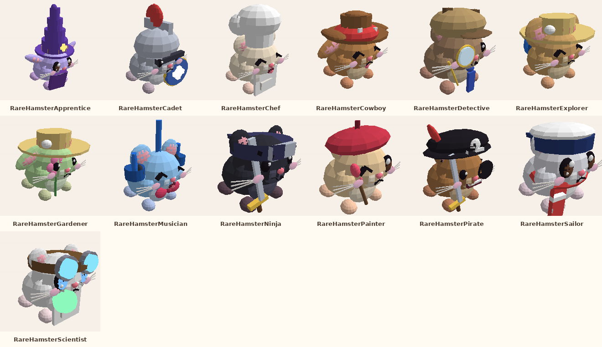

| Asset | Name in game | Id | Price | Income/s | Spawn chance | Speed | From rebirth | Parts |
|---|---|---|---|---|---|---|---|---|
| [RareHamsterNinja](Hamsters/Rare/RareHamsterNinja/) | Ninja | `ninja` | $9K | $60 | 0.4659% | 14 | 0 | 38 |
| [RareHamsterPirate](Hamsters/Rare/RareHamsterPirate/) | Pirate | `pirate` | $9.4K | $62.7 | 0.4659% | 14 | 0 | 40 |
| [RareHamsterCowboy](Hamsters/Rare/RareHamsterCowboy/) | Cowboy | `cowboy` | $9.8K | $65.3 | 0.4659% | 14 | 0 | 41 |
| [RareHamsterChef](Hamsters/Rare/RareHamsterChef/) | Chef | `chef` | $10K | $66.7 | 0.4659% | 14 | 0 | 36 |
| [RareHamsterApprentice](Hamsters/Rare/RareHamsterApprentice/) | Apprentice | `apprentice` | $11K | $73.3 | 0.4659% | 14 | 0 | 47 |
| [RareHamsterCadet](Hamsters/Rare/RareHamsterCadet/) | Cadet | `cadet` | $11K | $73.3 | 0.4659% | 14 | 0 | 40 |
| [RareHamsterDetective](Hamsters/Rare/RareHamsterDetective/) | Detective | `detective` | $11K | $73.3 | 0.4659% | 14 | 0 | 39 |
| [RareHamsterExplorer](Hamsters/Rare/RareHamsterExplorer/) | Explorer | `explorer` | $12K | $80 | 0.4659% | 14 | 0 | 39 |
| [RareHamsterPainter](Hamsters/Rare/RareHamsterPainter/) | Painter | `painter` | $12K | $80 | 0.4659% | 14 | 0 | 41 |
| [RareHamsterScientist](Hamsters/Rare/RareHamsterScientist/) | Scientist | `scientist` | $12K | $80 | 0.4659% | 14 | 0 | 46 |
| [RareHamsterGardener](Hamsters/Rare/RareHamsterGardener/) | Gardener | `gardener` | $13K | $86.7 | 0.4659% | 14 | 0 | 41 |
| [RareHamsterMusician](Hamsters/Rare/RareHamsterMusician/) | Musician | `musician` | $13K | $86.7 | 0.4659% | 14 | 0 | 40 |
| [RareHamsterSailor](Hamsters/Rare/RareHamsterSailor/) | Sailor | `sailor` | $14K | $93.3 | 0.4659% | 14 | 0 | 41 |

## Hamsters/Secret

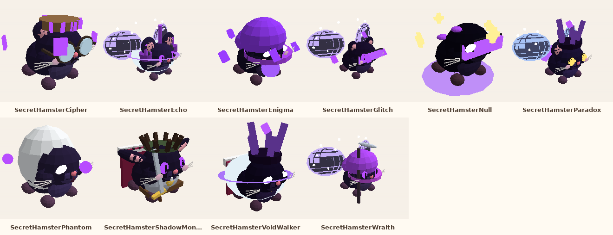

| Asset | Name in game | Id | Price | Income/s | Spawn chance | Speed | From rebirth | Parts |
|---|---|---|---|---|---|---|---|---|
| [SecretHamsterGlitch](Hamsters/Secret/SecretHamsterGlitch/) | Glitch | `glitch` | $1.5B | $1.36M | 0.0005047% | 42 | 9 | 55 |
| [SecretHamsterVoidWalker](Hamsters/Secret/SecretHamsterVoidWalker/) | Void Walker | `void_walker` | $1.6B | $1.45M | 0.0005047% | 42 | 9 | 37 |
| [SecretHamsterShadowMonarch](Hamsters/Secret/SecretHamsterShadowMonarch/) | Shadow Monarch | `shadow_monarch` | $1.7B | $1.55M | 0.0005047% | 42 | 9 | 57 |
| [SecretHamsterEnigma](Hamsters/Secret/SecretHamsterEnigma/) | Enigma | `enigma` | $1.8B | $1.64M | 0.0005047% | 42 | 9 | 37 |
| [SecretHamsterPhantom](Hamsters/Secret/SecretHamsterPhantom/) | Phantom | `phantom` | $1.8B | $1.64M | 0.0005047% | 42 | 9 | 27 |
| [SecretHamsterCipher](Hamsters/Secret/SecretHamsterCipher/) | Cipher | `cipher` | $1.9B | $1.73M | 0.0005047% | 42 | 9 | 45 |
| [SecretHamsterEcho](Hamsters/Secret/SecretHamsterEcho/) | Echo | `echo` | $2B | $1.82M | 0.0005047% | 42 | 9 | 57 |
| [SecretHamsterNull](Hamsters/Secret/SecretHamsterNull/) | Null | `null` | $2.1B | $1.91M | 0.0005047% | 42 | 9 | 43 |
| [SecretHamsterParadox](Hamsters/Secret/SecretHamsterParadox/) | Paradox | `paradox` | $2.2B | $2M | 0.0005047% | 42 | 9 | 65 |
| [SecretHamsterWraith](Hamsters/Secret/SecretHamsterWraith/) | Wraith | `wraith` | $2.3B | $2.09M | 0.0005047% | 42 | 9 | 45 |

## Hamsters/Shiny

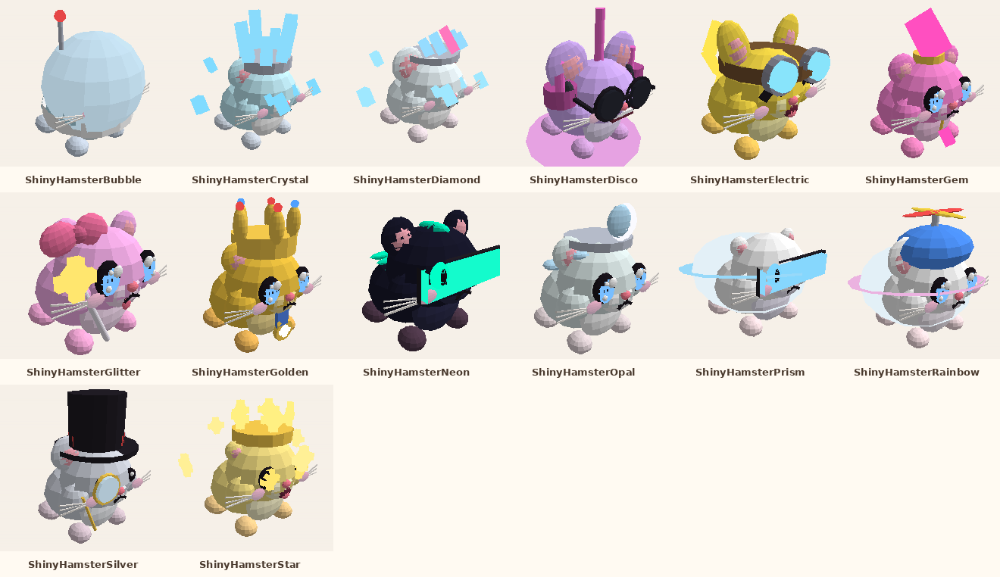

| Asset | Name in game | Id | Price | Income/s | Spawn chance | Speed | From rebirth | Parts |
|---|---|---|---|---|---|---|---|---|
| [ShinyHamsterCrystal](Hamsters/Shiny/ShinyHamsterCrystal/) | Crystal | `crystal` | $2K | $18.2 | 0.8652% | 12 | 0 | 41 |
| [ShinyHamsterNeon](Hamsters/Shiny/ShinyHamsterNeon/) | Neon | `neon` | $2.1K | $19.1 | 0.8652% | 12 | 0 | 36 |
| [ShinyHamsterGem](Hamsters/Shiny/ShinyHamsterGem/) | Gem | `gem` | $2.2K | $20 | 0.8652% | 12 | 0 | 40 |
| [ShinyHamsterRainbow](Hamsters/Shiny/ShinyHamsterRainbow/) | Rainbow | `rainbow` | $2.2K | $20 | 0.8652% | 12 | 0 | 42 |
| [ShinyHamsterStar](Hamsters/Shiny/ShinyHamsterStar/) | Star | `star` | $2.3K | $20.9 | 0.8652% | 12 | 0 | 73 |
| [ShinyHamsterBubble](Hamsters/Shiny/ShinyHamsterBubble/) | Bubble | `bubble` | $2.4K | $21.8 | 0.8652% | 12 | 0 | 38 |
| [ShinyHamsterElectric](Hamsters/Shiny/ShinyHamsterElectric/) | Electric | `electric` | $2.5K | $22.7 | 0.8652% | 12 | 0 | 38 |
| [ShinyHamsterGolden](Hamsters/Shiny/ShinyHamsterGolden/) | Golden | `golden` | $2.5K | $22.7 | 0.8652% | 12 | 0 | 53 |
| [ShinyHamsterSilver](Hamsters/Shiny/ShinyHamsterSilver/) | Silver | `silver` | $2.6K | $23.6 | 0.8652% | 12 | 0 | 36 |
| [ShinyHamsterDiamond](Hamsters/Shiny/ShinyHamsterDiamond/) | Diamond | `diamond` | $2.7K | $24.5 | 0.8652% | 12 | 0 | 39 |
| [ShinyHamsterGlitter](Hamsters/Shiny/ShinyHamsterGlitter/) | Glitter | `glitter` | $2.8K | $25.5 | 0.8652% | 12 | 0 | 45 |
| [ShinyHamsterPrism](Hamsters/Shiny/ShinyHamsterPrism/) | Prism | `prism` | $2.8K | $25.5 | 0.8652% | 12 | 0 | 34 |
| [ShinyHamsterOpal](Hamsters/Shiny/ShinyHamsterOpal/) | Opal | `opal` | $2.9K | $26.4 | 0.8652% | 12 | 0 | 44 |
| [ShinyHamsterDisco](Hamsters/Shiny/ShinyHamsterDisco/) | Disco | `disco` | $3K | $27.3 | 0.8652% | 12 | 0 | 45 |

## Hamsters/Ultra

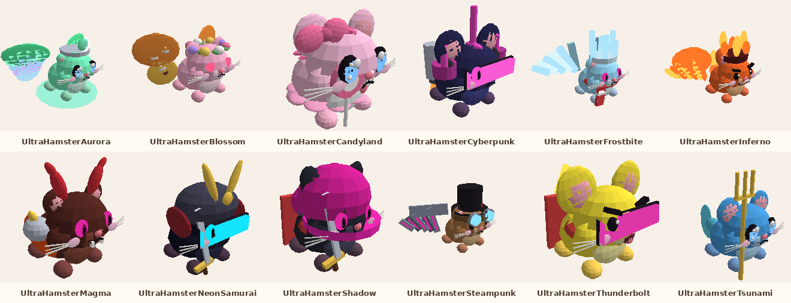

| Asset | Name in game | Id | Price | Income/s | Spawn chance | Speed | From rebirth | Parts |
|---|---|---|---|---|---|---|---|---|
| [UltraHamsterInferno](Hamsters/Ultra/UltraHamsterInferno/) | Inferno | `inferno` | $180K | $692 | 0.08412% | 19 | 0 | 54 |
| [UltraHamsterFrostbite](Hamsters/Ultra/UltraHamsterFrostbite/) | Frostbite | `frostbite` | $190K | $731 | 0.08412% | 19 | 0 | 53 |
| [UltraHamsterMagma](Hamsters/Ultra/UltraHamsterMagma/) | Magma | `magma` | $200K | $769 | 0.08412% | 19 | 0 | 48 |
| [UltraHamsterThunderbolt](Hamsters/Ultra/UltraHamsterThunderbolt/) | Thunderbolt | `thunderbolt` | $200K | $769 | 0.08412% | 19 | 0 | 40 |
| [UltraHamsterTsunami](Hamsters/Ultra/UltraHamsterTsunami/) | Tsunami | `tsunami` | $210K | $808 | 0.08412% | 19 | 0 | 43 |
| [UltraHamsterBlossom](Hamsters/Ultra/UltraHamsterBlossom/) | Blossom | `blossom` | $220K | $846 | 0.08412% | 19 | 0 | 60 |
| [UltraHamsterShadow](Hamsters/Ultra/UltraHamsterShadow/) | Shadow | `shadow` | $230K | $885 | 0.08412% | 19 | 0 | 39 |
| [UltraHamsterCyberpunk](Hamsters/Ultra/UltraHamsterCyberpunk/) | Cyberpunk | `cyberpunk` | $240K | $923 | 0.08412% | 19 | 0 | 50 |
| [UltraHamsterCandyland](Hamsters/Ultra/UltraHamsterCandyland/) | Candyland | `candyland` | $250K | $962 | 0.08412% | 19 | 0 | 57 |
| [UltraHamsterSteampunk](Hamsters/Ultra/UltraHamsterSteampunk/) | Steampunk | `steampunk` | $250K | $962 | 0.08412% | 19 | 0 | 60 |
| [UltraHamsterAurora](Hamsters/Ultra/UltraHamsterAurora/) | Aurora | `aurora` | $260K | $1K | 0.08412% | 19 | 0 | 50 |
| [UltraHamsterNeonSamurai](Hamsters/Ultra/UltraHamsterNeonSamurai/) | Neon Samurai | `neon_samurai` | $270K | $1.04K | 0.08412% | 19 | 0 | 40 |

## Hamsters/Unknown

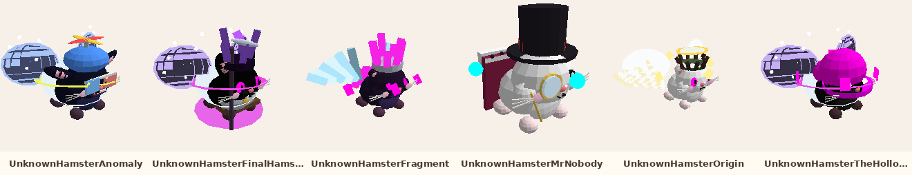

| Asset | Name in game | Id | Price | Income/s | Spawn chance | Speed | From rebirth | Parts |
|---|---|---|---|---|---|---|---|---|
| [UnknownHamsterTheHollowOne](Hamsters/Unknown/UnknownHamsterTheHollowOne/) | The Hollow One | `the_hollow_one` | $35B | $19.4M | 6.73e-05% | 56 | 15 | 47 |
| [UnknownHamsterMrNobody](Hamsters/Unknown/UnknownHamsterMrNobody/) | Mr. Nobody | `mr_nobody` | $39B | $21.7M | 6.73e-05% | 56 | 15 | 42 |
| [UnknownHamsterFragment](Hamsters/Unknown/UnknownHamsterFragment/) | Fragment | `fragment` | $42B | $23.3M | 6.73e-05% | 56 | 15 | 57 |
| [UnknownHamsterAnomaly](Hamsters/Unknown/UnknownHamsterAnomaly/) | Anomaly | `anomaly` | $46B | $25.6M | 6.73e-05% | 56 | 15 | 63 |
| [UnknownHamsterOrigin](Hamsters/Unknown/UnknownHamsterOrigin/) | Origin | `origin` | $49B | $27.2M | 6.73e-05% | 56 | 15 | 77 |
| [UnknownHamsterFinalHamster](Hamsters/Unknown/UnknownHamsterFinalHamster/) | Final Hamster | `final_hamster` | $53B | $29.4M | 6.73e-05% | 56 | 15 | 65 |

## Plants

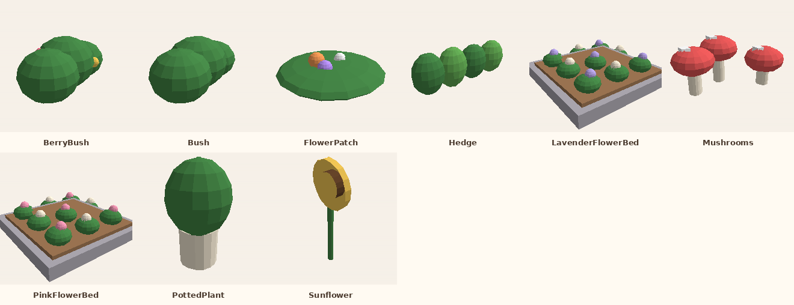

| Asset | Size (studs, X x Y x Z) | Parts | Built by | Notes |
|---|---|---|---|---|
| [BerryBush](Plants/BerryBush/) | 5.76 x 2.77 x 3.85 | 6 | `Decor.bush(berries)` |  |
| [Bush](Plants/Bush/) | 5.76 x 2.77 x 3.85 | 3 | `Decor.bush` |  |
| [FlowerPatch](Plants/FlowerPatch/) | 4.25 x 1.27 x 4.25 | 4 | `Decor.flowers` |  |
| [Hedge](Plants/Hedge/) | 12.6 x 4.74 x 2.6 | 4 | `Decor.hedgeRun` |  |
| [LavenderFlowerBed](Plants/LavenderFlowerBed/) | 7 x 1.82 x 7 | 20 | `Decor.flowerBed(lavender)` |  |
| [Mushrooms](Plants/Mushrooms/) | 3.5 x 1.63 x 2.38 | 9 | `Decor.mushrooms` |  |
| [PinkFlowerBed](Plants/PinkFlowerBed/) | 7 x 1.82 x 7 | 20 | `Decor.flowerBed(pink)` |  |
| [PottedPlant](Plants/PottedPlant/) | 2.6 x 4.3 x 2.6 | 2 | `HouseBuilder.Furniture.Plant` |  |
| [Sunflower](Plants/Sunflower/) | 0.92 x 6.51 x 3 | 3 | `Decor.sunflower` |  |

## Props

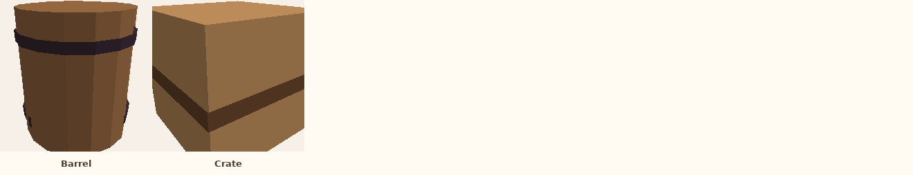

| Asset | Size (studs, X x Y x Z) | Parts | Built by | Notes |
|---|---|---|---|---|
| [Barrel](Props/Barrel/) | 2.3 x 2.6 x 2.3 | 3 | `Decor.barrel` |  |
| [Crate](Props/Crate/) | 2.5 x 2.4 x 2.5 | 2 | `Decor.crate` |  |

## Props/Stations

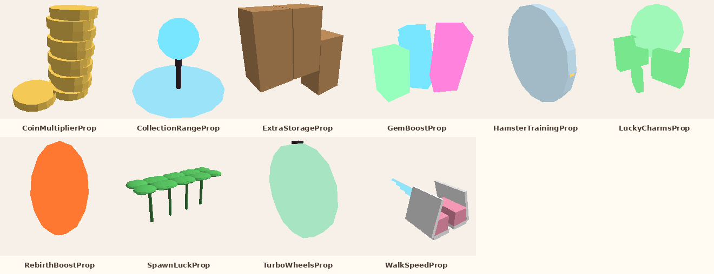

| Asset | Size (studs, X x Y x Z) | Parts | Built by | Notes |
|---|---|---|---|---|
| [CoinMultiplierProp](Props/Stations/CoinMultiplierProp/) | 3.21 x 2.99 x 2.12 | 11 | `HouseBuilder.StationProps.CoinMultiplier` | Shown on the upgrade pedestal, grows with the upgrade level. |
| [CollectionRangeProp](Props/Stations/CollectionRangeProp/) | 4.4 x 3.4 x 4.4 | 3 | `HouseBuilder.StationProps.CollectionRange` | Shown on the upgrade pedestal, grows with the upgrade level. |
| [ExtraStorageProp](Props/Stations/ExtraStorageProp/) | 3.4 x 3.3 x 1.1 | 6 | `HouseBuilder.StationProps.ExtraStorage` | Shown on the upgrade pedestal, grows with the upgrade level. |
| [GemBoostProp](Props/Stations/GemBoostProp/) | 2.3 x 2.02 x 2.83 | 6 | `HouseBuilder.StationProps.GemBoost` | Shown on the upgrade pedestal, grows with the upgrade level. |
| [HamsterTrainingProp](Props/Stations/HamsterTrainingProp/) | 0.4 x 4.2 x 4.2 | 3 | `HouseBuilder.StationProps.HamsterTraining` | Shown on the upgrade pedestal, grows with the upgrade level. |
| [LuckyCharmsProp](Props/Stations/LuckyCharmsProp/) | 2.53 x 3.1 x 2.65 | 6 | `HouseBuilder.StationProps.LuckyCharms` | Shown on the upgrade pedestal, grows with the upgrade level. |
| [RebirthBoostProp](Props/Stations/RebirthBoostProp/) | 2.1 x 3.57 x 2.1 | 2 | `HouseBuilder.StationProps.RebirthBoost` | Shown on the upgrade pedestal, grows with the upgrade level. |
| [SpawnLuckProp](Props/Stations/SpawnLuckProp/) | 5.54 x 2.24 x 1.94 | 20 | `HouseBuilder.StationProps.SpawnLuck` | Shown on the upgrade pedestal, grows with the upgrade level. |
| [TurboWheelsProp](Props/Stations/TurboWheelsProp/) | 0.5 x 3.78 x 3.6 | 2 | `HouseBuilder.StationProps.TurboWheels` | Shown on the upgrade pedestal, grows with the upgrade level. |
| [WalkSpeedProp](Props/Stations/WalkSpeedProp/) | 2.74 x 2 x 6 | 11 | `HouseBuilder.StationProps.WalkSpeed` | Shown on the upgrade pedestal, grows with the upgrade level. |

## Trees

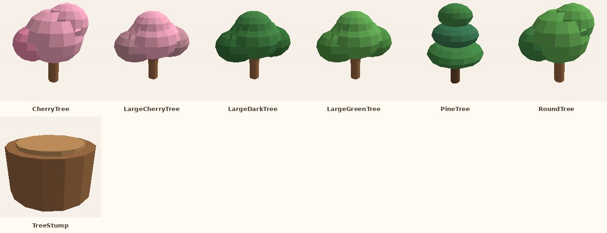

| Asset | Size (studs, X x Y x Z) | Parts | Built by | Notes |
|---|---|---|---|---|
| [CherryTree](Trees/CherryTree/) | 10 x 12 x 8.5 | 4 | `Decor.tree(cherry)` |  |
| [LargeCherryTree](Trees/LargeCherryTree/) | 22.04 x 19.03 x 19.49 | 9 | `Decor.largeTree(Cherry)` |  |
| [LargeDarkTree](Trees/LargeDarkTree/) | 22.04 x 19.03 x 19.49 | 9 | `Decor.largeTree(LeafDark)` |  |
| [LargeGreenTree](Trees/LargeGreenTree/) | 22.04 x 19.03 x 19.49 | 9 | `Decor.largeTree` |  |
| [PineTree](Trees/PineTree/) | 8.52 x 12.4 x 8.52 | 4 | `Decor.tree(pine)` |  |
| [RoundTree](Trees/RoundTree/) | 10 x 12 x 8.5 | 4 | `Decor.tree(round)` |  |
| [TreeStump](Trees/TreeStump/) | 2.2 x 1.27 x 2.2 | 2 | `Decor.stump` |  |

## UI/Icons

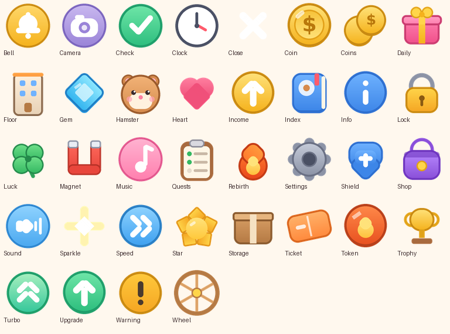

Drawn from `src/ReplicatedStorage/Modules/IconShapes.luau` (the game draws the same shapes with Frames). PNG, 256 x 256, transparent background.

`Bell`, `Camera`, `Check`, `Clock`, `Close`, `Coin`, `Coins`, `Daily`, `Floor`, `Gem`, `Hamster`, `Heart`, `Income`, `Index`, `Info`, `Lock`, `Luck`, `Magnet`, `Music`, `Quests`, `Rebirth`, `Settings`, `Shield`, `Shop`, `Sound`, `Sparkle`, `Speed`, `Star`, `Storage`, `Ticket`, `Token`, `Trophy`, `Turbo`, `Upgrade`, `Warning`, `Wheel`
